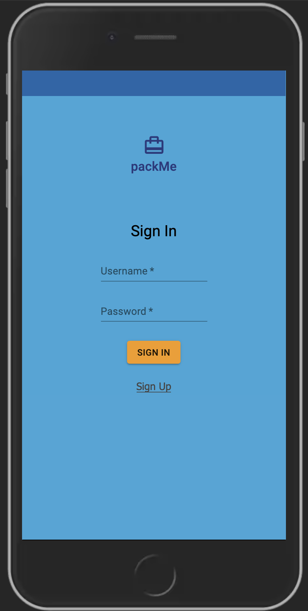
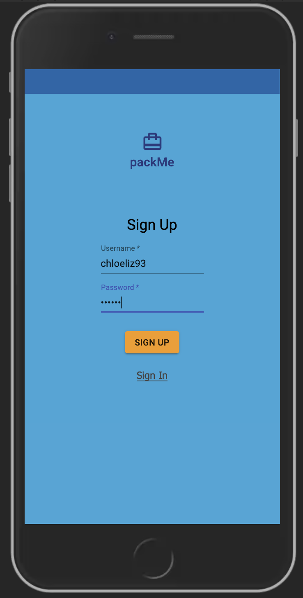
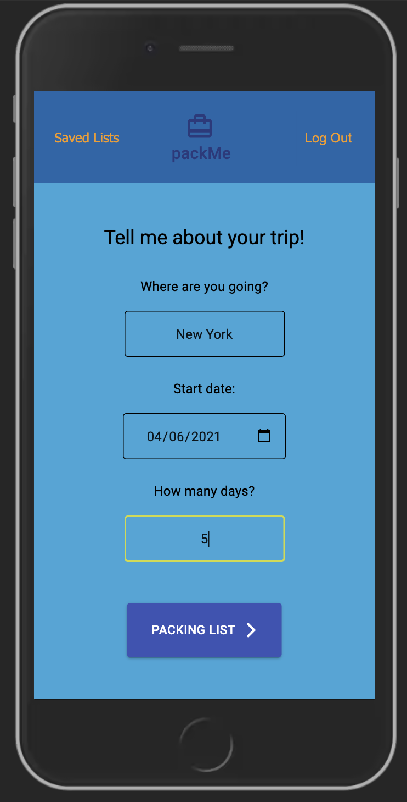
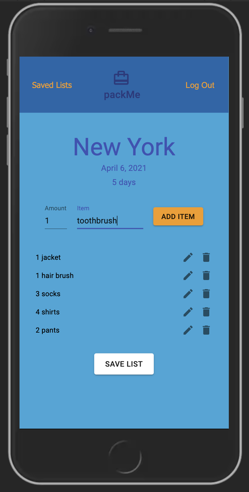
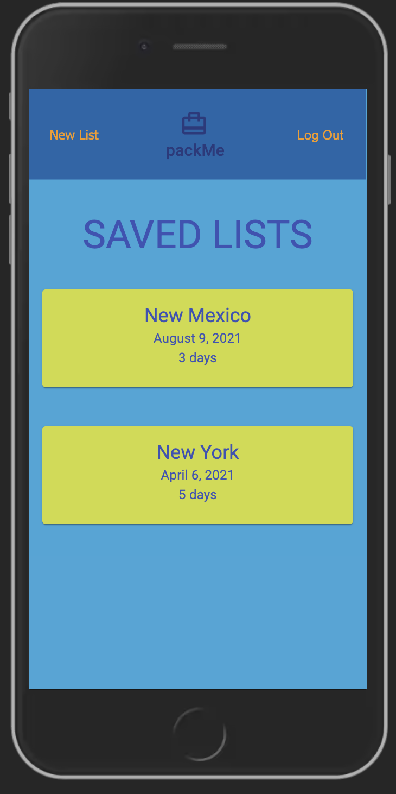
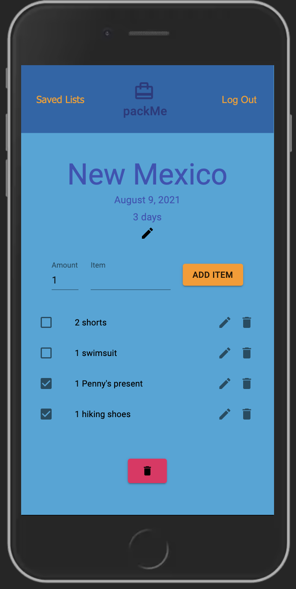

# packMe

## About

This app helps manage and organize packing for travel by allowing you to save, edit, and delete packing lists and their items. 

A user can create and save multiple lists. 

A user can keep track of which items they have packed using a checkbox system.

Future builds: Feature to generate suggested packing items based on prompts using weather API

## Technologies Used

- JavaScript
- React
- Redux
- Sagas
- Passport
- HTML
- CSS
- Material UI
- PostgreSQL
- Node
- Express


## Setup 

- Run `npm install`
- Create a `.env` file at the root of the project and paste this line into the file:
  ```
  SERVER_SESSION_SECRET=superDuperSecret
  ```
- Replace `superDuperSecret` with some long random string like `25POUbVtx6RKVNWszd9ERB9Bb6` to keep your application secure. 
- Start postgres if not running already by using `brew services start postgresql`
- Run `npm run server`
- Run `npm run client`
- Navigate to `localhost:3000`

- If you would like to name your database something else, you will need to change `packMe` to the name of your new database name in `server/modules/pool.js`

## Screenshots








